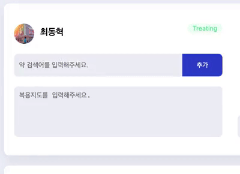
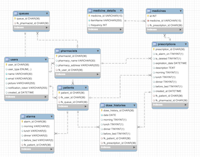

# 💊 MEDI READY


<code>#Medicine</code>
<code>#복용이력관리</code>
<code>#고객관리</code>
<code>#푸시알림</code>

약 먹을 시간을 자동으로 관리해 주는 서비스, Medi Ready입니다!

약을 언제 먹었는지 기억하지 못해 고민하고 계시나요?
이제는 Medi Ready를 통해 복용 이력을 손쉽게 관리해 보세요.
Medi Ready는 **자동으로** 알림이 등록되기 때문에 간단하게 이용하실 수 있어요.

<br>

## 📚 Contents

- [💊 MEDI READY](#-medi-ready)
- [📚 Contents](#-contents)
- [🔗 Links](#-links)
- [🔍 Preview](#-preview)
- [👨‍⚕️ Motivation](#️-motivation)
- [🔥 Features](#-features)
- [🎬 Getting Started](#-getting-started)
- [🖥 Tech Stacks](#-tech-stacks)
- [🤝 우리는 이렇게 개발했습니다](#-우리는-이렇게-개발했습니다)

<br>

## 🔗 Links

> RN 앱은 배포가 되지 않아, Expo를 통해 로컬에서 실행해야 합니다.

### deploy

- [Medi-Ready](https://www.mediready.kr)

### Github Repositories

- [Frontend Repo](https://github.com/Medi-Ready/medi-ready-frontend)
- [React-Native Repo](https://github.com/Medi-Ready/medi-ready-rn)
- [Backend Repo](https://github.com/Medi-Ready/medi-ready-backend)
- [Push-Notification-Server Repo](https://github.com/Medi-Ready/medi-ready-push-notification)

<br>

## 🔍 Preview

https://user-images.githubusercontent.com/68883173/140311703-02f6fe0f-c6bd-4d5b-aa17-b7175a50a44a.mp4

- 환자가 약국에 가서 체크인을 합니다.
- 약사가 환자의 앱에 복약지도와 처방을 전달합니다.
- 환자의 앱에 알람이 등록됩니다.

https://user-images.githubusercontent.com/68883173/140312725-4827c5f2-9f55-4e50-b134-5433862c3273.mp4

- 설정한 시간에 푸시 알림이 울립니다.
- 백그라운드 환경에서도 푸시 알림이 전달됩니다.

https://user-images.githubusercontent.com/68883173/140314350-f6c548d1-dfda-4c24-bf45-2734bc167d08.mp4

- 복용 이력을 관리할 수 있습니다.
- 처방 내역을 관리할 수 있습니다.
- 알람 시간을 설정할 수 있습니다.

<br>

## 👨‍⚕️ Motivation

매일 챙겨 먹어야 하는 약을 먹었는지 안 먹었는지 기억이 나지 않을 때가 종종 있습니다. 그때마다 알림 앱을 찾아보곤 하는데요. 대부분의 앱들은 매번 직접 약을 등록해야 하거나 복용 이력을 관리할 수 없는 단점이 있어 잘 사용하지 않게 되었습니다. 그런데, 만약 **자동으로** 알림이 설정되고, 또 약 먹을 시간에 알림까지 울린다면 정말 편리하지 않을까? 라고 생각하게 되어 이 프로젝트를 기획하게 되었습니다.

어떻게 자동으로 알림을 등록할 수 있을까 고민을 하였는데요. 최근 코로나로 인해 모든 장소에서 QR 체크인을 사용하는 것에서 영감을 얻어, 환자가 약국에서 QR 체크인을 하면 시스템상에 등록되도록 프로젝트를 진행했습니다.

또한, 약국 계정에 처방 내역이 축적되기 때문에 약국 입장에서는 고객을 관리하는 동시에 약 먹을 시간을 알려주는 서비스를 제공할 수 있다는 측면에서 매력적이라고 느꼈습니다.

<br>

## 🔥 Features

### 약사용 CRM (웹)

- 환자는 QR 체크인을 통해, 대기 명단에 이름을 올릴 수 있습니다.
- 약사는 처방전과 복약 지도를 환자의 앱으로 전송합니다.
- 환자의 앱에 약 알림이 등록됩니다. ex) 3일간 아침, 점심, 저녁
- 과거 처방 이력을 확인할 수 있습니다.

### 환자용 앱

- 날짜별/시간별로 복용 여부를 체크할 수 있습니다.
- 설정한 시간에 푸시 알림을 받습니다.
- 알람을 켜고 끌 수 있으며, 알람 이력을 확인할 수 있습니다.
- 지난 처방 이력을 확인할 수 있으며, 약 정보를 확인할 수 있습니다.

<br>

## 🎬 Getting Started

Local 환경에서 실행 시 아래와 같이 환경 변수를 설정해야 합니다.

<details>
  <summary>Client (Web)</summary>
.env 파일에 아래와 같이 환경 변수를 입력해 주세요.

```
REACT_APP_API_KEY=<Firebase API Key>
REACT_APP_AUTH_DOMAIN=<Firebase Auth Domain>
REACT_APP_PROJECT_ID=<Firebase Project ID>
REACT_APP_APP_ID=<Firebase App ID>

REACT_APP_BASE_URL=<default = http://localhost:8080>
```

</details>

<details>
  <summary>Client (React Native Mobile App)</summary>
environment.js 파일에 아래와 같이 환경 변수를 입력해 주세요.

```
import Constants from "expo-constants";

const ENV = {
  dev: {
    IOS_CLIENT_ID: <Google OAuth IOS client ID>,
    ANDROID_CLIENT_ID: <Google OAuth Android client ID>,
    API_SERVER_URL: <YOUR_IP_ADDRESS_WITH_PROT>,
  },
};

const getEnvVars = (env = Constants.manifest.releaseChannel) => {
  if (__DEV__) {
    return ENV.dev;
  }
};

export default getEnvVars;
```

</details>

<details>
  <summary>Main Server</summary>
.env 파일에 아래와 같이 환경 변수를 입력해 주세요.

```
ORIGIN_URI_DEV=<origin uri: default = "http://localhost:3000">
PUSH_NOTIFICATION_URI=<origin uri: default = http://localhost:8081>

MYSQL_USERNAME=<mysql username: default = root>
MYSQL_PASSWORD=<mysql password>
MYSQL_DATABASE=mediready
MYSQL_HOST=<my sql host: default = "127.0.0.1">

JWT_SECRET_KEY=<jwt secret key>
COOKIE_SECRET_KEY=<cookie secret key>
```

</details>

<details>
<summary>Push Notification Server</summary>
.env 파일에 아래와 같이 환경 변수를 입력해 주세요.

```
EXPO_ACCESS_TOKEN=<Expo Access Token>
```

</details>

<br>

## 🖥 Tech Stacks

### Client

- React
- React Native (Expo)
- Styled-Component
- Redux Toolkit
- Redux Saga
- React Query

### Server

- Node JS
- Express
- MySQL, Sequelize
- AWS RDS
- Node Schedule
- Expo Server SDK(Firebase Cloud Messaging)

### Testing

- Jest
- React Testing Library
- Mocha, Chai
  > Test Case Coverage
  > Client 54%, React Native 46%, Server 73%

### Deployment

- Netlify
- AWS Elastic Beanstalk

<br>

## 🤝 우리는 이렇게 개발했습니다

### 컴포넌트 계층 구조 디자인

팀 프로젝트를 진행하면서 효율적인 협업 방식과 각자 맡은 부분의 디자인적 통일성을 위해 컴포넌트 구조를 설계했습니다. 특히, 컴포넌트를 일반화한 뒤 합성(Composition)해서 사용할 수 있도록 했고, 한 곳에서만 사용되는 컴포넌트라도 재사용성을 고려하여 분리했습니다. 또한 Proptypes를 설정하여 컴포넌트의 속성을 쉽게 파악할 수 있도록 했습니다.

이로 인해 작업 시간을 단축하고, 불필요한 커뮤니케이션 과정을 줄일 수 있었으며, 잘 분리된 컴포넌트 덕분에 수월하게 테스트 코드를 작성할 수 있었습니다. 또한 리액트적인 사고방식의 중요성과 컴포넌트를 순수하게 작성하는 것의 장점에 대해 느낄 수 있었습니다.

### React Native Life Cycle 이해

브라우저에서 실행되는 React와는 다르게, 모바일 애플리케이션에서 실행되는 React native는 다른 화면으로 이동했을 때 component가 unmount 되지 않고 stack 구조로 쌓이기 때문에 life cycle을 이용하여 전역 상태를 관리하는 데 어려움을 겪었습니다. 이 문제를 해결하기 위해 React Navigation의 "focus" 이벤트를 사용하여 상태를 업데이트하는 방식을 사용하였습니다.

```js
navigation.addListener("focus", () => {
  dispatch(...);
});
```

### Redux Saga의 도입

이번 프로젝트에서 React Native를 처음 접했기 때문에, 프로젝트 기간을 고려하여 Expo를 사용했습니다. 그러나 비동기 처리를 할 때면 종종 에러가 발생했고, 핸들링이 쉽지 않았습니다. 그래서 비동기 및 사이드 이펙트 관리와 역할에 따른 코드 분할이 용이한 Redux-Saga를 도입하기로 결정했습니다.

Generator와 같은 새로운 개념들을 이해하고 적용하는 데 시간이 소요되었지만, 결과적으로 효율적인 에러 핸들링이 가능하다는 점을 느꼈습니다. 특히 비동기 처리를 단순히 기다리는 것이 아니라, 주도적으로 액션을 모니터링하고 컨트롤할 수 있다는 점에서 Redux-Saga의 장점을 느낄 수 있었습니다.

다만, Toolkit과 Redux-Saga를 분리하여 파일 구조를 설계했다는 점에서 아쉬움이 남습니다. 다음번에는 Slice와 Redux-Saga가 하나의 파일이 한 가지 기능을 담당하는 Ducks 패턴을 이용해 더욱 직관적인 구조를 설계해 보고 싶습니다.

<details>
  <summary>예시</summary>

```
// What I did

src/
  api
  component
  redux/
    reducers
    store
  sagas/
    handlers
    rootSaga.js

// What I should have done

src/
  api
  component
  feature/
      index.js
      slice.js
      saga.js
```

</details>

### Push Notification

초기에는 Firebase Cloud Messaging과 직접 통신하여 푸시 알림 기능을 구현하려고 기획했습니다. 그러나 해당 방식은 안드로이드/IOS를 구분하여 개발해야 한다는 점과 비용을 지불해야 한다는 단점이 있어 Expo SDK 서버를 통해 우회적으로 FCM을 이용하는 방식을 도입했습니다.

하지만, FCM 서버와 직접 통신하지 않는 탓에 설정한 알림을 관리하기가 어렵다는 점이 아쉽게 느껴집니다. 현재로서는 알림을 위한 별도 서버를 구축하였지만, DB에 알림 정보를 모두 저장한 뒤 Node schedule과 Expo SDK 서버를 통해 우회적으로 알림을 관리해야 하는 비효율적인 구조를 갖고 있습니다. 추후에는 이러한 점을 개선하여 알림 서비스를 더욱 효율적으로 관리해 보고 싶은 마음입니다.

### Search Algorithms



CRM 목적에 부합하기 위해, 환자 정보에 기반하여 검색어를 추천하는 알고리즘을 구현하려고 시도했습니다. 그러나 의학적인 지식과 많은 데이터가 필요하다는 점에서 한계가 있다고 판단하여 다른 방식을 찾아보았습니다. 결과적으로, 현재 CRM 상에서 키워드와 검색 빈도수에 기반하여 데이터를 제공하게 되었습니다.

### MySQL



DB Modeling 과정에서 복잡한 관계가 예상되어 관계형 데이터베이스를 처음으로 다루어 보았습니다. NoSQL의 Nested 형태에 익숙한 탓에, 사고를 전환하는데 시간이 많이 소요되었습니다. 하지만 복잡한 관계를 연결 짓고, Join과 Cascade를 이용하여 데이터를 다루면서 SQL의 장점을 느끼게 되었습니다. 특히 복잡한 관계 때문에 데이터를 잘못 입력한 경우가 있었는데, 그때마다 올바른 데이터 구조가 아니라는 오류 메시지로 인해 쉽게 오류를 잡아낼 수 있었습니다. 아직은 관계형 데이터베이스가 익숙하지 않은 탓에, 쿼리문 최적화를 시도하지 못했는데, 추후에 꼭 한번 시도해 보고 싶습니다.
